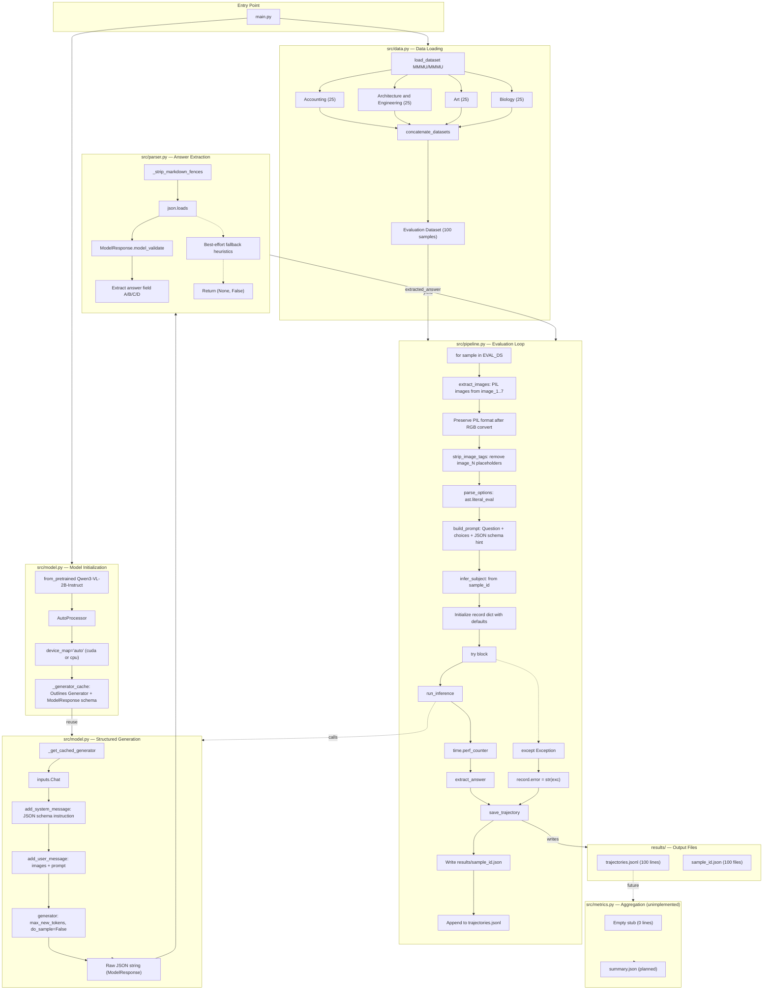

# Qwen3-VL MMMU Evaluation Pipeline

Evaluation pipeline for running **Qwen3-VL-2B-Instruct** locally on 100 samples from the **MMMU** (Massive Multi-discipline Multimodal Understanding) dataset.

## Features

- **Structured Generation**: Every model response is constrained at decode time by a Pydantic schema (`{"reasoning": "...", "answer": "A|B|C|D"}`) using the Outlines library, guaranteeing parseable JSON output.
- **100-sample cap**: The pipeline evaluates at most 100 unique MMMU samples per run.
- **Stratified sampling**: Samples are selected proportionally across subjects (e.g., ~25 from each of 4 subjects).
- **Resumable**: If interrupted, restarting skips already-completed samples and continues up to the cap.
- **Deterministic**: The same 100 stratified samples are selected on every fresh start, ensuring reproducible results.
- **Graceful failures**: Individual sample errors are logged without halting the pipeline.
- **Chain-of-Thought reasoning**: The prompt instructs the model to provide step-by-step reasoning before emitting the final structured answer, with `MAX_NEW_TOKENS = 2048` to prevent truncation.

## Setup

```bash
# Clone the repository
git clone <repo-url>
cd <repo-folder>

# Install dependencies with uv
uv sync
```

The pipeline uses **stratified sampling** to ensure balanced representation across MMMU subjects. For example, with 4 subjects and a 100-sample cap, the pipeline selects approximately 25 samples from each subject deterministically. Any shortfall in a subject (if it has fewer samples than its quota) is not backfilled from other subjects, so the total may be slightly below 100 in edge cases.

## Usage

```bash
# Full evaluation (up to 100 samples)
python -m src.main

# Results are written to:
#   results/trajectories.jsonl   — one JSON record per sample
#   results/summary.json          — aggregate metrics
```

### Resume a partial run

Simply rerun `python -m src.main`. The pipeline reads `results/trajectories.jsonl`, skips completed sample IDs, and evaluates the remaining samples up to the 100-sample cap.

## Project Structure

```bash
# Verify deterministic & stratified selection
python scripts/verify_determinism.py
```

- `src/config.py` — Cap value, paths, subject list, quota helper, and `MAX_NEW_TOKENS = 2048`
- `src/data.py` — MMMU dataset loading and **stratified** deterministic sample selection
- `src/model.py` — Qwen3-VL model loading and **Outlines structured generation** inference
- `src/parser.py` — Answer extraction via **Pydantic JSON validation** (no regex)
- `src/pipeline.py` — Per-sample evaluation and trajectory persistence
- `src/metrics.py` — Accuracy, per-subject stats, and summary generation
- `src/main.py` — Orchestration loop with resume logic
- `src/schemas.py` — Pydantic `ModelResponse` schema with `reasoning` and `answer` fields

## Architecture

The diagram below shows the full data flow from MMMU dataset loading through structured generation to `trajectories.jsonl`.



## Structured Generation

The pipeline uses **Outlines** to enforce a Pydantic schema at every decoding step. This means the model is physically incapable of emitting invalid JSON or answers outside the allowed set (A, B, C, D).

### How it works

1. **Schema definition** (`src/schemas.py`): A `ModelResponse` Pydantic model defines two fields:
   - `reasoning`: free-form text for step-by-step chain-of-thought
   - `answer`: constrained to exactly one of `A`, `B`, `C`, `D`

2. **Constrained generation** (`src/model.py`): The Outlines `Generator` wraps the Qwen3-VL model with a logits processor that only allows tokens conforming to the schema at each decoding step.

3. **Deterministic parsing** (`src/parser.py`): Raw responses are parsed with `json.loads()` + `ModelResponse.model_validate()`. There is **zero regex-based extraction** — either the response validates against the schema or it is flagged as a parse failure.

4. **Prompt design** (`src/pipeline.py`): The evaluation prompt explicitly instructs the model to think step by step and then emit ONLY valid JSON matching the schema.

### Verification

To confirm the pipeline is using structured generation:

```bash
# Check parser has no regex answer extraction
grep -E "re\.(search|match|findall|compile)" src/parser.py
# Expected: no output

# Check model uses Outlines Generator
grep "Generator" src/model.py
# Expected: lines referencing Generator with output_type=ModelResponse

# Check prompt requests reasoning + JSON
grep "Think step by step" src/pipeline.py
# Expected: the prompt line
```

```bash
python scripts/verify_determinism.py
```

The pipeline uses **stratified sampling** to ensure balanced representation across MMMU subjects. For example, with 4 subjects and a 100-sample cap, the pipeline selects approximately 25 samples from each subject deterministically. Any shortfall in a subject (if it has fewer samples than its quota) is not backfilled from other subjects, so the total may be slightly below 100 in edge cases.

## License

MIT
