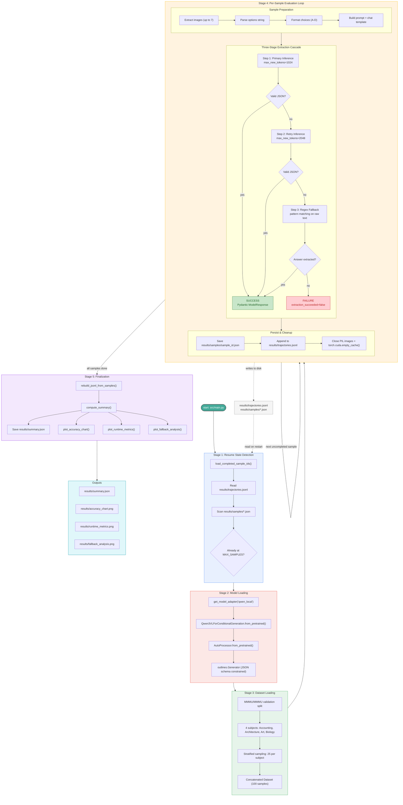

# Qwen3-VL MMMU Evaluation Pipeline

## Key Metrics (latest run)

| Metric | Value |
|---|---|
| Model | Qwen3-VL-2B-Instruct |
| Samples | 100 (25 per subject) |
| Overall Accuracy | 41% |
| Parse Failure Rate | 0% |
| Avg Inference Time | 7.05s |
| Total Runtime | ~11.7 min |
| Best Subject | Art (56%) |
| Worst Subject | Architecture & Engineering (28%) |
